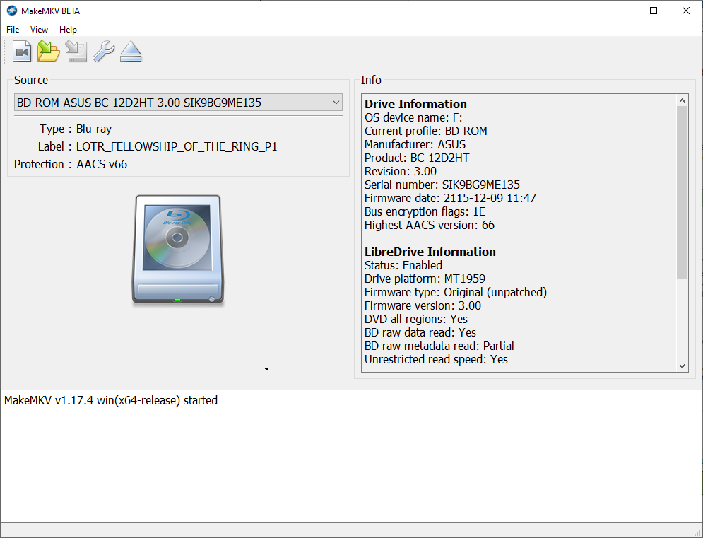
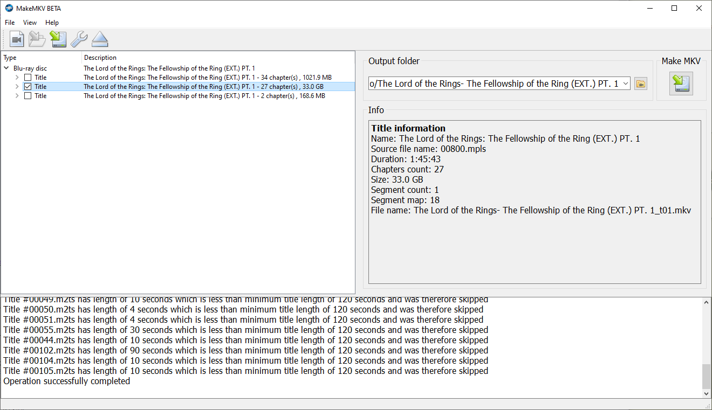
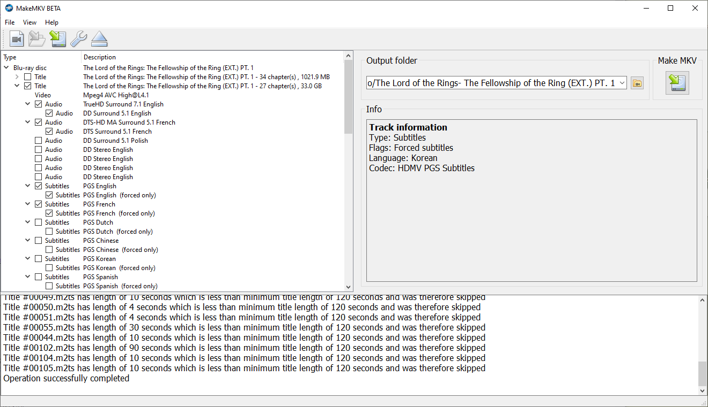
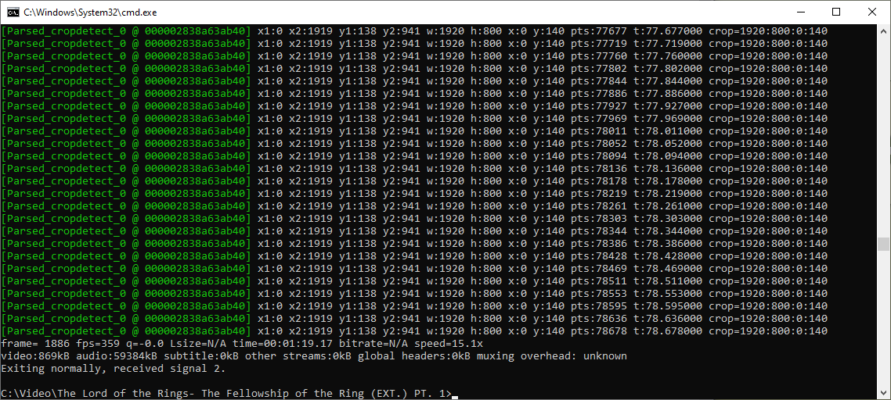

# Copying Blu-ray discs

These are my personal notes on how to create a digital copy of a blu-ray disc.
Shared here in the hope that they may be useful to somebody.

**Tools:**
- MakeMKV: https://www.makemkv.com/
- FFmpeg: https://ffmpeg.org/
- (optional) MKVToolNix: https://mkvtoolnix.download/downloads.html

Note: If you are getting asked for a license by MakeMKV... Good news, [MakeMKV is free while in beta](https://forum.makemkv.com/forum/viewtopic.php?f=5&t=1053)!

## Step 1. Create a copy of the bluray using MakeMKV

Open the bluray with MakeMKV.



Once the bluray is open, select the tracks that you want to copy.



As can be seen in the above screenshot, there are quite often significant differences in 
the size of the tracks.
This is a good help for identifying the relevant tracks.

Expand the tree to select in more details the subtracks that you want to be included in 
the output file.



Specify a custom output directory if the default one does not suit your needs, 
than click on the MakeMKV button in the top-right corner.

Extraction begins!

## Step 2. Encoding the video

In this section, we will re-encode the video using FFmpeg.

**(Optional) Cropping**

Play the `.mkv` file produced by MakeMKV.

If black stripes appear above and below the video, as can be seen in the screenshot below; 
these can be cropped by FFmpeg.


Use FFmpeg to detect the crop:
```bash
ffmpeg -ss 00:10:00 -i "The Lord of the Rings- The Fellowship of the Ring (EXT.) PT. 1_t01.mkv" -vf cropdetect -f null -
```



In this example, the crop parameters are `w:1920 h:800 x:0 y:140`.

You can verify that these parameters looks reasonnable by estimating the parameters yourself in another software.
I personally do it using MS Paint.

We will apply the crop later using the `crop` filter of FFmpeg: `-vf crop=w:h:x:y`.

**Listing the streams**

You can list the streams in the MKV by giving it as input to FFmpeg without specifying any output file.
```bash
ffmpeg -i "The Lord of the Rings- The Fellowship of the Ring (EXT.) PT. 1_t01.mkv"
```

Which in this example produces:
```
Input #0, matroska,webm, from 'The Lord of the Rings- The Fellowship of the Ring (EXT.) PT. 1_t01.mkv':
  Metadata:
    title           : The Lord of the Rings: The Fellowship of the Ring (EXT.) PT. 1
    encoder         : libmakemkv v1.17.4 (1.3.10/1.5.2) win(x64-release)
    creation_time   : 2023-08-04T13:23:25.000000Z
  Duration: 01:45:43.38, start: 0.000000, bitrate: 41094 kb/s
  Chapters:
    Chapter #0:0: start 0.000000, end 457.165042
      Metadata:
        title           : Chapter 01
    Chapter #0:1: start 457.165042, end 635.635000
      Metadata:
        title           : Chapter 02
    Chapter #0:2: start 635.635000, end 939.813875
      Metadata:
        title           : Chapter 03
    Chapter #0:3: start 939.813875, end 1198.447250
      Metadata:
        title           : Chapter 04
    Chapter #0:4: start 1198.447250, end 1532.322458
      Metadata:
        title           : Chapter 05
    Chapter #0:5: start 1532.322458, end 1797.337208
      Metadata:
        title           : Chapter 06
    Chapter #0:6: start 1797.337208, end 1930.637042
      Metadata:
        title           : Chapter 07
    Chapter #0:7: start 1930.637042, end 2091.380958
      Metadata:
        title           : Chapter 08
    Chapter #0:8: start 2091.380958, end 2178.509667
      Metadata:
        title           : Chapter 09
    Chapter #0:9: start 2178.509667, end 2704.118083
      Metadata:
        title           : Chapter 10
    Chapter #0:10: start 2704.118083, end 2804.259792
      Metadata:
        title           : Chapter 11
    Chapter #0:11: start 2804.259792, end 3081.203125
      Metadata:
        title           : Chapter 12
    Chapter #0:12: start 3081.203125, end 3312.350708
      Metadata:
        title           : Chapter 13
    Chapter #0:13: start 3312.350708, end 3450.029917
      Metadata:
        title           : Chapter 14
    Chapter #0:14: start 3450.029917, end 3811.474333
      Metadata:
        title           : Chapter 15
    Chapter #0:15: start 3811.474333, end 4035.698333
      Metadata:
        title           : Chapter 16
    Chapter #0:16: start 4035.698333, end 4133.420958
      Metadata:
        title           : Chapter 17
    Chapter #0:17: start 4133.420958, end 4235.898333
      Metadata:
        title           : Chapter 18
    Chapter #0:18: start 4235.898333, end 4515.260750
      Metadata:
        title           : Chapter 19
    Chapter #0:19: start 4515.260750, end 4666.828833
      Metadata:
        title           : Chapter 20
    Chapter #0:20: start 4666.828833, end 5051.296250
      Metadata:
        title           : Chapter 21
    Chapter #0:21: start 5051.296250, end 5172.417250
      Metadata:
        title           : Chapter 22
    Chapter #0:22: start 5172.417250, end 5381.542833
      Metadata:
        title           : Chapter 23
    Chapter #0:23: start 5381.542833, end 5594.297042
      Metadata:
        title           : Chapter 24
    Chapter #0:24: start 5594.297042, end 5754.039958
      Metadata:
        title           : Chapter 25
    Chapter #0:25: start 5754.039958, end 5852.930417
      Metadata:
        title           : Chapter 26
    Chapter #0:26: start 5852.930417, end 6343.378708
      Metadata:
        title           : Chapter 27
  Stream #0:0(eng): Video: h264 (High), yuv420p(progressive), 1920x1080 [SAR 1:1 DAR 16:9], 23.98 fps, 23.98 tbr, 1k tbn
    Metadata:
      BPS-eng         : 33256245
      DURATION-eng    : 01:45:43.378708333
      NUMBER_OF_FRAMES-eng: 152089
      NUMBER_OF_BYTES-eng: 26369617086
      SOURCE_ID-eng   : 001011
      _STATISTICS_WRITING_APP-eng: MakeMKV v1.17.4 win(x64-release)
      _STATISTICS_WRITING_DATE_UTC-eng: 2023-08-04 13:23:25
      _STATISTICS_TAGS-eng: BPS DURATION NUMBER_OF_FRAMES NUMBER_OF_BYTES SOURCE_ID
  Stream #0:1(eng): Audio: truehd, 48000 Hz, 7.1, s32 (24 bit) (default)
    Metadata:
      title           : Surround 7.1
      BPS-eng         : 3000191
      DURATION-eng    : 01:45:43.379166666
      NUMBER_OF_FRAMES-eng: 7612055
      NUMBER_OF_BYTES-eng: 2378919206
      SOURCE_ID-eng   : 001100
      _STATISTICS_WRITING_APP-eng: MakeMKV v1.17.4 win(x64-release)
      _STATISTICS_WRITING_DATE_UTC-eng: 2023-08-04 13:23:25
      _STATISTICS_TAGS-eng: BPS DURATION NUMBER_OF_FRAMES NUMBER_OF_BYTES SOURCE_ID
  Stream #0:2(eng): Audio: ac3, 48000 Hz, 5.1(side), fltp, 448 kb/s
    Metadata:
      title           : Surround 5.1
      BPS-eng         : 448000
      DURATION-eng    : 01:45:43.392000000
      NUMBER_OF_FRAMES-eng: 198231
      NUMBER_OF_BYTES-eng: 355229952
      SOURCE_ID-eng   : 001100
      _STATISTICS_WRITING_APP-eng: MakeMKV v1.17.4 win(x64-release)
      _STATISTICS_WRITING_DATE_UTC-eng: 2023-08-04 13:23:25
      _STATISTICS_TAGS-eng: BPS DURATION NUMBER_OF_FRAMES NUMBER_OF_BYTES SOURCE_ID
  Stream #0:3(fra): Audio: dts (DTS-HD MA), 48000 Hz, 5.1(side), s16p
    Metadata:
      title           : Surround 5.1
      BPS-eng         : 2335915
      DURATION-eng    : 01:45:43.381333333
      NUMBER_OF_FRAMES-eng: 594692
      NUMBER_OF_BYTES-eng: 1852199912
      SOURCE_ID-eng   : 001101
      _STATISTICS_WRITING_APP-eng: MakeMKV v1.17.4 win(x64-release)
      _STATISTICS_WRITING_DATE_UTC-eng: 2023-08-04 13:23:25
      _STATISTICS_TAGS-eng: BPS DURATION NUMBER_OF_FRAMES NUMBER_OF_BYTES SOURCE_ID
  Stream #0:4(fra): Audio: dts (DTS), 48000 Hz, 5.1(side), fltp, 1536 kb/s
    Metadata:
      title           : Surround 5.1
      BPS-eng         : 1509000
      DURATION-eng    : 01:45:43.381333333
      NUMBER_OF_FRAMES-eng: 594692
      NUMBER_OF_BYTES-eng: 1196520304
      SOURCE_ID-eng   : 001101
      _STATISTICS_WRITING_APP-eng: MakeMKV v1.17.4 win(x64-release)
      _STATISTICS_WRITING_DATE_UTC-eng: 2023-08-04 13:23:25
      _STATISTICS_TAGS-eng: BPS DURATION NUMBER_OF_FRAMES NUMBER_OF_BYTES SOURCE_ID
  Stream #0:5(eng): Subtitle: hdmv_pgs_subtitle
    Metadata:
      BPS-eng         : 27457
      DURATION-eng    : 01:45:05.987187500
      NUMBER_OF_FRAMES-eng: 2190
      NUMBER_OF_BYTES-eng: 21643141
      SOURCE_ID-eng   : 001200
      _STATISTICS_WRITING_APP-eng: MakeMKV v1.17.4 win(x64-release)
      _STATISTICS_WRITING_DATE_UTC-eng: 2023-08-04 13:23:25
      _STATISTICS_TAGS-eng: BPS DURATION NUMBER_OF_FRAMES NUMBER_OF_BYTES SOURCE_ID
  Stream #0:6(fra): Subtitle: hdmv_pgs_subtitle
    Metadata:
      BPS-eng         : 23956
      DURATION-eng    : 01:45:02.108312500
      NUMBER_OF_FRAMES-eng: 2250
      NUMBER_OF_BYTES-eng: 18872219
      SOURCE_ID-eng   : 001201
      _STATISTICS_WRITING_APP-eng: MakeMKV v1.17.4 win(x64-release)
      _STATISTICS_WRITING_DATE_UTC-eng: 2023-08-04 13:23:25
      _STATISTICS_TAGS-eng: BPS DURATION NUMBER_OF_FRAMES NUMBER_OF_BYTES SOURCE_ID
  Stream #0:7(fra): Subtitle: hdmv_pgs_subtitle
    Metadata:
      BPS-eng         : 517
      DURATION-eng    : 01:39:48.378229166
      NUMBER_OF_FRAMES-eng: 36
      NUMBER_OF_BYTES-eng: 387413
      SOURCE_ID-eng   : 00120C
      _STATISTICS_WRITING_APP-eng: MakeMKV v1.17.4 win(x64-release)
      _STATISTICS_WRITING_DATE_UTC-eng: 2023-08-04 13:23:25
      _STATISTICS_TAGS-eng: BPS DURATION NUMBER_OF_FRAMES NUMBER_OF_BYTES SOURCE_ID
  Stream #0:8(eng): Subtitle: hdmv_pgs_subtitle
    Metadata:
      BPS-eng         : 72051
      DURATION-eng    : 01:45:34.932770833
      NUMBER_OF_FRAMES-eng: 3840
      NUMBER_OF_BYTES-eng: 57055226
      SOURCE_ID-eng   : 00120D
      _STATISTICS_WRITING_APP-eng: MakeMKV v1.17.4 win(x64-release)
      _STATISTICS_WRITING_DATE_UTC-eng: 2023-08-04 13:23:25
      _STATISTICS_TAGS-eng: BPS DURATION NUMBER_OF_FRAMES NUMBER_OF_BYTES SOURCE_ID
  Stream #0:9(eng): Subtitle: hdmv_pgs_subtitle
    Metadata:
      BPS-eng         : 57521
      DURATION-eng    : 01:45:34.015187500
      NUMBER_OF_FRAMES-eng: 3144
      NUMBER_OF_BYTES-eng: 45542667
      SOURCE_ID-eng   : 00120E
      _STATISTICS_WRITING_APP-eng: MakeMKV v1.17.4 win(x64-release)
      _STATISTICS_WRITING_DATE_UTC-eng: 2023-08-04 13:23:25
      _STATISTICS_TAGS-eng: BPS DURATION NUMBER_OF_FRAMES NUMBER_OF_BYTES SOURCE_ID
  Stream #0:10(eng): Subtitle: hdmv_pgs_subtitle
    Metadata:
      BPS-eng         : 75317
      DURATION-eng    : 01:45:35.641812500
      NUMBER_OF_FRAMES-eng: 3778
      NUMBER_OF_BYTES-eng: 59648444
      SOURCE_ID-eng   : 00120F
      _STATISTICS_WRITING_APP-eng: MakeMKV v1.17.4 win(x64-release)
      _STATISTICS_WRITING_DATE_UTC-eng: 2023-08-04 13:23:25
      _STATISTICS_TAGS-eng: BPS DURATION NUMBER_OF_FRAMES NUMBER_OF_BYTES SOURCE_ID
  Stream #0:11(eng): Subtitle: hdmv_pgs_subtitle
    Metadata:
      BPS-eng         : 65804
      DURATION-eng    : 01:45:26.424270833
      NUMBER_OF_FRAMES-eng: 4140
      NUMBER_OF_BYTES-eng: 52038274
      SOURCE_ID-eng   : 001210
      _STATISTICS_WRITING_APP-eng: MakeMKV v1.17.4 win(x64-release)
      _STATISTICS_WRITING_DATE_UTC-eng: 2023-08-04 13:23:25
      _STATISTICS_TAGS-eng: BPS DURATION NUMBER_OF_FRAMES NUMBER_OF_BYTES SOURCE_ID
  Stream #0:12(fra): Subtitle: hdmv_pgs_subtitle
    Metadata:
      BPS-eng         : 52749
      DURATION-eng    : 01:45:34.140312500
      NUMBER_OF_FRAMES-eng: 3101
      NUMBER_OF_BYTES-eng: 41765648
      SOURCE_ID-eng   : 001211
      _STATISTICS_WRITING_APP-eng: MakeMKV v1.17.4 win(x64-release)
      _STATISTICS_WRITING_DATE_UTC-eng: 2023-08-04 13:23:25
      _STATISTICS_TAGS-eng: BPS DURATION NUMBER_OF_FRAMES NUMBER_OF_BYTES SOURCE_ID
  Stream #0:13(fra): Subtitle: hdmv_pgs_subtitle
    Metadata:
      BPS-eng         : 47934
      DURATION-eng    : 01:45:33.931770833
      NUMBER_OF_FRAMES-eng: 3263
      NUMBER_OF_BYTES-eng: 37951969
      SOURCE_ID-eng   : 001212
      _STATISTICS_WRITING_APP-eng: MakeMKV v1.17.4 win(x64-release)
      _STATISTICS_WRITING_DATE_UTC-eng: 2023-08-04 13:23:25
      _STATISTICS_TAGS-eng: BPS DURATION NUMBER_OF_FRAMES NUMBER_OF_BYTES SOURCE_ID
  Stream #0:14(fra): Subtitle: hdmv_pgs_subtitle
    Metadata:
      BPS-eng         : 59269
      DURATION-eng    : 01:45:34.849354166
      NUMBER_OF_FRAMES-eng: 3290
      NUMBER_OF_BYTES-eng: 46933075
      SOURCE_ID-eng   : 001213
      _STATISTICS_WRITING_APP-eng: MakeMKV v1.17.4 win(x64-release)
      _STATISTICS_WRITING_DATE_UTC-eng: 2023-08-04 13:23:25
      _STATISTICS_TAGS-eng: BPS DURATION NUMBER_OF_FRAMES NUMBER_OF_BYTES SOURCE_ID
  Stream #0:15(fra): Subtitle: hdmv_pgs_subtitle
    Metadata:
      BPS-eng         : 47512
      DURATION-eng    : 01:45:26.549395833
      NUMBER_OF_FRAMES-eng: 3321
      NUMBER_OF_BYTES-eng: 37573809
      SOURCE_ID-eng   : 001214
      _STATISTICS_WRITING_APP-eng: MakeMKV v1.17.4 win(x64-release)
      _STATISTICS_WRITING_DATE_UTC-eng: 2023-08-04 13:23:25
      _STATISTICS_TAGS-eng: BPS DURATION NUMBER_OF_FRAMES NUMBER_OF_BYTES SOURCE_ID
  Stream #0:16: Video: mjpeg (Baseline), yuvj444p(pc, bt470bg/unknown/unknown), 640x360 [SAR 72:72 DAR 16:9], 90k tbr, 90k tbn (attached pic)
    Metadata:
      filename        : cover.jpg
      mimetype        : image/jpeg
At least one output file must be specified
```

Make a list of the audio streams you want to keep.

In this example, I will keep:
- `Stream #0:0(eng)` (the video)
- `Stream #0:1(eng)` (english audio)
- `Stream #0:3(fr)` (french audio)

There are multiple audio tracks in french & english in this Bluray.
Most of the time these are the same tracks but with different qualities; 
sometimes there is also the audio-commentary track.

I usually keep the first one in each language, or the one the larger ones (best quality).
The `DURATION` and `NUMBER_OF_BYTES` fields of each track give good clues about 
which one is right.

As for the subtitles track, I usually deal with them later using MKVToolNix; but you can 
copy them directly using FFmpeg.

Learn more about stream selection in FFmpeg: https://trac.ffmpeg.org/wiki/Map

**Testing the encoding**

I use the following codecs:
- video: h265 (see [H.265/HEVC Video Encoding Guide](https://trac.ffmpeg.org/wiki/Encode/H.265))
- audio: libopus (see [Guidelines for high quality lossy audio encoding](https://trac.ffmpeg.org/wiki/Encode/HighQualityAudio))

Unless using a lossless codec, encoding is about trading quality for space.
The better the quality, the more space required.
Or in other words, smaller files means less quality.

I recommend testing the quality by encoding a few seconds of the video using various values for the CRF.

Example:
```bash
ffmpeg -ss 00:10:00 -i "The Lord of the Rings- The Fellowship of the Ring (EXT.) PT. 1_t01.mkv" -t 15 -map 0:0 -map 0:1 -map 0:3 -vf crop=1920:800:0:140 -c:v libx265 -crf 26 -preset fast -c:a libopus -ac 2 test-quality.mkv
```

Explanations:

| Argument                     | Description                                                   |
|------------------------------|---------------------------------------------------------------|
| `--ss 00:10:00`              | Skip the first 10 seconds of the movie                        |
| `-i movie.mkv`               | Path to the input file                                        |
| `-t 15`                      | Encode 15 seconds                                             |
| `-map 0:0 -map 0:1 -map 0:3` | Select streams #0, #1 and #3 from the input file              |
| `-vf crop=1920:800:0:140`    | Apply the crop **v**ideo **f**ilter                           |
| `-c:v libx265`               | The **c**odec to use for the **v**ideo is H265                |
| `-crf 26`                    | Specify the CRF which controls the quality of the video       |
| `-preset fast`               | Use the "fast" preset                                         |
| `-c:a libopus`               | The **c**odec to use for the **a**udio is Opus                |
| `-ac 2`                      | Number of **a**udio **c**hannel for the output audio set to 2 |

The `--crf` argument specifies the constant rate factor which controls the quality of the video encoding.
The higher the value, the lower the quality.
The default value is 28.

Note: I use the "fast" preset while testing; when everything seems fine, I remove this argument to use the default preset.

I want quality, but I do not want my files to be too big!
Next step is to encode a larger chunk of the movie to get an estimate of the total size.

Example: encoding 20 minutes (approx 15% of total), starting at the 50min mark.
```bash
ffmpeg -ss 00:50:00 -i "The Lord of the Rings- The Fellowship of the Ring (EXT.) PT. 1_t01.mkv" -t 1200 -map 0:0 -map 0:1 -map 0:3 -vf crop=1920:800:0:140 -c:v libx265 -crf 24 -preset fast -c:a libopus -ac 2 test-filesize.mkv
```

If it seems filesize will be too much, increase the CRF.
You may decrease the CRF (to get better quality) if filesize is in acceptable range.

**Encoding**

The final command I used in this example.

```bash
ffmpeg -i "The Lord of the Rings- The Fellowship of the Ring (EXT.) PT. 1_t01.mkv" -map 0:0 -map 0:1 -map 0:3 -vf crop=1920:800:0:140 -c:v libx265 -crf 24 -c:a libopus -ac 2 video.mkv
```

## Step 3. Muxing it all together

In this last step, the subtitles from the original MKV file and the H265-encoded video are 
merged together in a single, final, MKV file.

Subtitles selection can be done by playing the original file in VLC and 
testing each subtitle-track.
Alternatively, it is often possible to guess which tracks to keep using 
the stream list in FFmpeg output.

Drag'n drop both the original and new MKV files into MKVToolNix.

Select the track you want to keep from each file.


MKVToolNix makes it really easy to rename tracks, set track flags (e.g., "Default track").

Finally, click the "Start multiplexing" button.

Final results:

| Original file size  | Final file size | Compression ratio |
|---------------------|-----------------|-------------------|
| 30.3 GiB            | 1.45 GiB        | 95.2%             |
